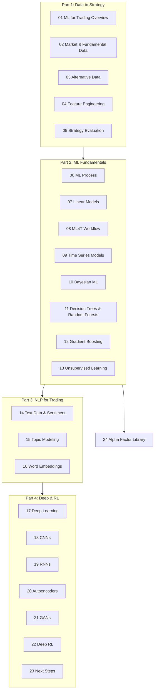
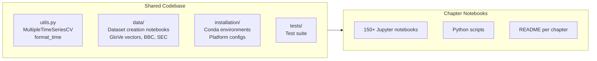
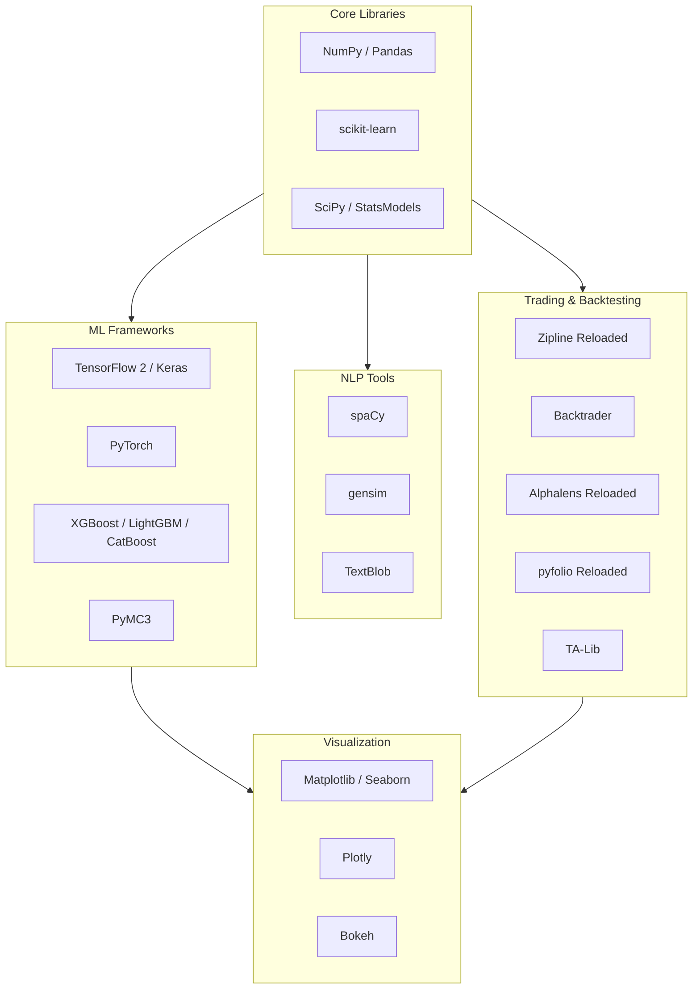

# Machine Learning for Trading - Documentation

> **Last Updated**: 2026-04-06T17:20:03Z  \
> **Git Hash**: `9f5faa5`

> Comprehensive guide to Stefan Jansen's ML for Algorithmic Trading, 2nd Edition.
> Over 150 Jupyter notebooks covering the full ML4T workflow from data sourcing to strategy backtesting.

## Overview

This repository accompanies the book *Machine Learning for Algorithmic Trading* and demonstrates
how ML can add value to algorithmic trading strategies. It spans 23 chapters plus an appendix,
organized in four parts covering data sourcing, supervised/unsupervised ML, NLP, and deep/reinforcement
learning -- all applied to real trading scenarios.

## Key Features

| Area | Coverage |
|------|----------|
| **Data Sources** | Market (NASDAQ ITCH, Algoseek), fundamental (SEC EDGAR), alternative (earnings calls, satellite imagery) |
| **ML Models** | Linear, tree-based, Bayesian, time series, unsupervised, deep learning, reinforcement learning |
| **NLP** | Tokenization, topic modeling, word embeddings, sentiment analysis, SEC filing analysis |
| **Backtesting** | Vectorized, event-driven (Zipline, Backtrader), portfolio optimization (pyfolio) |
| **Alpha Factors** | 100+ factors from TA-Lib, WorldQuant 101 Formulaic Alphas, Alphalens evaluation |

## Chapter Map



## Part 1: From Data to Strategy Development

| Chapter | Directory | Focus |
|---------|-----------|-------|
| 01 | `01_machine_learning_for_trading/` | Industry trends, ML in the investment process |
| 02 | `02_market_and_fundamental_data/` | NASDAQ ITCH order book, Algoseek intraday, SEC EDGAR |
| 03 | `03_alternative_data/` | Web scraping, earnings call transcripts |
| 04 | `04_alpha_factor_research/` | TA-Lib, Kalman filter, wavelets, Zipline, Alphalens |
| 05 | `05_strategy_evaluation/` | Backtesting, portfolio optimization, Kelly rule, pyfolio |

## Part 2: ML for Trading Fundamentals

| Chapter | Directory | Focus |
|---------|-----------|-------|
| 06 | `06_machine_learning_process/` | Bias-variance, cross-validation, `MultipleTimeSeriesCV` |
| 07 | `07_linear_models/` | Ridge, Lasso, Fama-MacBeth, logistic regression |
| 08 | `08_ml4t_workflow/` | End-to-end backtest with Zipline and Backtrader |
| 09 | `09_time_series_models/` | ARIMA, GARCH, VAR, cointegration, pairs trading |
| 10 | `10_bayesian_machine_learning/` | PyMC3, dynamic Sharpe ratio, stochastic volatility |
| 11 | `11_decision_trees_random_forests/` | Long-short strategy for Japanese equities |
| 12 | `12_gradient_boosting_machines/` | XGBoost, LightGBM, CatBoost, SHAP, intraday strategy |
| 13 | `13_unsupervised_learning/` | PCA, ICA, t-SNE, UMAP, clustering, hierarchical risk parity |

## Part 3: NLP for Trading

| Chapter | Directory | Focus |
|---------|-----------|-------|
| 14 | `14_working_with_text_data/` | spaCy, TextBlob, document-term matrix, Naive Bayes |
| 15 | `15_topic_modeling/` | LSI, pLSA, LDA with sklearn and gensim |
| 16 | `16_word_embeddings/` | Word2Vec, Doc2Vec, GloVe, SEC filing return prediction |

## Part 4: Deep and Reinforcement Learning

| Chapter | Directory | Focus |
|---------|-----------|-------|
| 17 | `17_deep_learning/` | Feedforward NNs, TensorFlow 2, PyTorch |
| 18 | `18_convolutional_neural_nets/` | LeNet5, AlexNet, time-series-to-image, satellite images |
| 19 | `19_recurrent_neural_nets/` | LSTM, GRU, multivariate time series, sentiment |
| 20 | `20_autoencoders_for_conditional_risk_factors/` | Variational autoencoders, conditional asset pricing |
| 21 | `21_gans_for_synthetic_time_series/` | DCGAN, TimeGAN, synthetic data evaluation |
| 22 | `22_deep_reinforcement_learning/` | Q-learning, Deep Q-Networks, custom trading env |
| 23 | `23_next_steps/` | Summary and future directions |
| 24 | `24_alpha_factor_library/` | 100+ alpha factors, formulaic alphas, factor evaluation |

## Shared Resources



## Quick Start

This example loads the bundled US equities metadata, engineers a simple momentum factor, and evaluates it with a basic long-short backtest -- all using data shipped in the repo (no API keys or downloads needed).

```python
import numpy as np
import pandas as pd
from pathlib import Path

np.random.seed(42)
PROJECT_DIR = Path(".")  # repo root

# 1. Load the bundled US equities metadata (ships in data/)
meta = pd.read_csv(PROJECT_DIR / "data" / "us_equities_meta_data.csv")
print(f"Universe: {len(meta)} stocks")
print(meta[["ticker", "marketcap", "ipoyear", "sector"]].head())

# 2. Load sample wiki stock prices (requires running data/create_datasets.ipynb once)
#    If HDF5 store is not yet created, use the CSV fallback:
wiki_csv = PROJECT_DIR / "data" / "wiki_stocks.csv"
prices = pd.read_csv(wiki_csv, parse_dates=["date"], index_col=["date", "ticker"])
print(f"\nPrice data: {len(prices)} rows, columns: {list(prices.columns)}")

# 3. Compute a simple 20-day momentum factor
close = prices["adj_close"].unstack("ticker")
momentum = close.pct_change(20)

# 4. Rank stocks each day and form long-short quintile portfolios
daily_ranks = momentum.rank(axis=1, pct=True)
long_mask = daily_ranks > 0.8   # top 20%
short_mask = daily_ranks < 0.2  # bottom 20%

returns = close.pct_change().shift(-1)  # next-day return
long_ret = (returns * long_mask).mean(axis=1)
short_ret = (returns * short_mask).mean(axis=1)
ls_ret = long_ret - short_ret

print(f"\nLong-short momentum strategy:")
print(f"  Annualized return: {ls_ret.mean() * 252:.2%}")
print(f"  Annualized vol:    {ls_ret.std() * np.sqrt(252):.2%}")
print(f"  Sharpe ratio:      {ls_ret.mean() / ls_ret.std() * np.sqrt(252):.2f}")
```

### Data Acquisition Guide

Most notebooks require datasets beyond what ships in the repo. Run the data preparation notebooks **once** before working through chapters.

| Dataset | Source | Notebook | Approx Size | API Key? |
|---------|--------|----------|-------------|----------|
| Quandl Wiki Prices | Quandl/Nasdaq | `data/create_datasets.ipynb` | ~1 GB (HDF5) | Yes (free Quandl API key) |
| Stooq JP/US Prices | stooq.com | `data/create_stooq_data.ipynb` | ~500 MB | No (manual download since Dec 2020) |
| Yelp Reviews | Yelp Open Dataset | `data/create_yelp_review_data.ipynb` | ~5 GB | No (manual download from Yelp) |
| GloVe Vectors | Stanford NLP | `data/glove_word_vectors.ipynb` | ~2 GB | No |
| Twitter Sentiment | Twitter API | `data/twitter_sentiment.ipynb` | ~100 MB | Yes (Twitter API credentials) |
| SEC Filings | SEC EDGAR | `data/sec-filings/` | ~2 GB | No |
| BBC News | bundled zip | `data/bbc.zip` | 5 MB | No (included) |
| Earnings Calls | bundled zip | `data/earnings_calls.zip` | 20 MB | No (included) |
| NASDAQ ITCH | Lobster Data | Chapter 02 README | ~10 GB | Varies |
| Algoseek Intraday | Algoseek | [algoseek.com/ml4t-book-data](https://www.algoseek.com/ml4t-book-data.html) | ~5 GB | Free registration |

**Minimal setup** (enough for Parts 1-2): Run `data/create_datasets.ipynb` with a Quandl API key, then run `data/create_stooq_data.ipynb` to get Japanese equity and US ETF data.

## Documentation Index

| Document | Description |
|----------|-------------|
| [Architecture](architecture.md) | Project structure, module organization, ML model architectures |
| [Workflow](workflow.md) | Data preparation, feature engineering, model training, backtesting flows |
| [State Management](state-management.md) | Data state, model state, experiment tracking, results persistence |
| [Development](development.md) | Development standards, adding new strategies, ML best practices |
| [Migration Guide](MIGRATION_GUIDE.md) | Dependency migration and upgrade instructions |

## Technology Stack



## External Links

- [Book on Amazon](https://www.amazon.com/Machine-Learning-Algorithmic-Trading-alternative/dp/1839217715)
- [ML4T Community](https://exchange.ml4trading.io/)
- [Book Website](https://ml4trading.io)
- [Zipline Reloaded](https://zipline.ml4trading.io/)
- [Algoseek Data](https://www.algoseek.com/ml4t-book-data.html)
