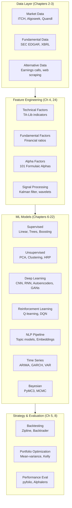
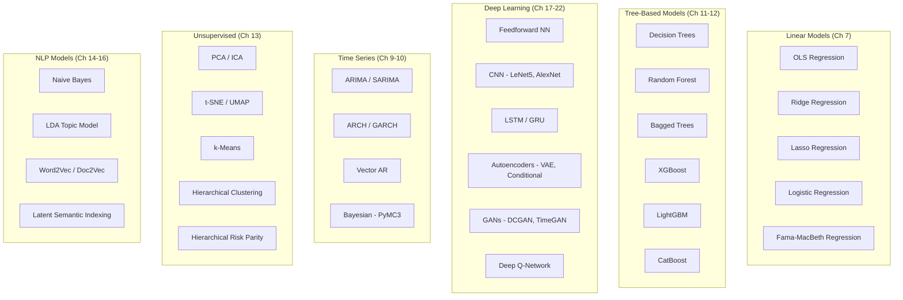
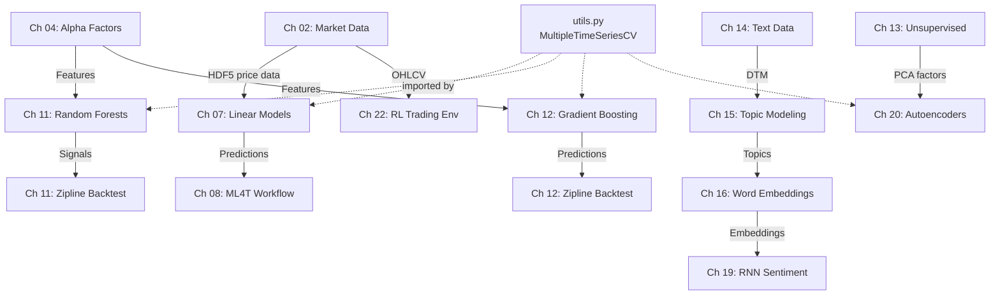

# Architecture

> Project structure, module organization, data pipeline design, and ML model architectures
> covered in Machine Learning for Trading.

## Trading Paradigm & Key Features

| Feature | Support | Details |
|---------|---------|---------|
| Backtesting Approach | Both | Vectorized (pandas/NumPy) and event-driven (Zipline, Backtrader) in Chapter 8 |
| Live Trading | No | Research and educational project; no live trading capability |
| Paper Trading | No | Backtesting only via Zipline and Backtrader |
| Multi-Asset | Yes | US equities, Japanese equities, international stocks (Stooq), crypto (via RL env) |
| Data Feeds | Multiple | NASDAQ ITCH 5.0, Algoseek, Quandl Wiki, SEC EDGAR, Stooq, earnings transcripts |
| ML Integration | Yes | Comprehensive: linear models, trees, boosting, deep learning, NLP, RL (Ch 6-22) |
| Risk Management | Custom | Portfolio optimization (mean-variance, Kelly, HRP), pyfolio analysis, Alphalens |
| Optimization | Yes | Hyperparameter tuning via grid/random search, cross-validation with `MultipleTimeSeriesCV` |
| Execution | Simulated | Zipline and Backtrader simulate order execution with configurable slippage/commission |

## Repository Layout

The repository follows a chapter-per-directory structure with 24 numbered directories, each
containing Jupyter notebooks, Python scripts, chapter-specific data, and a README. Shared
utilities and data preparation live at the root level.

```
machine-learning-for-trading/
├── 01_machine_learning_for_trading/    # Conceptual overview (Part 1 start)
├── 02_market_and_fundamental_data/     # ITCH, Algoseek, SEC, data providers
│   ├── 01_NASDAQ_TotalView-ITCH_Order_Book/
│   ├── 02_algoseek_intraday/
│   ├── 03_data_providers/
│   ├── 04_sec_edgar/
│   └── 05_storage_benchmark/
├── 03_alternative_data/                # Web scraping, earnings calls
├── 04_alpha_factor_research/           # Feature engineering, TA-Lib, Kalman
├── 05_strategy_evaluation/             # Backtesting, portfolio optimization
├── 06_machine_learning_process/        # Cross-validation, bias-variance
├── 07_linear_models/                   # Ridge, Lasso, Fama-MacBeth, logistic
├── 08_ml4t_workflow/                   # End-to-end backtest pipeline
│   ├── 00_data/data_prep.py
│   ├── 01_multiple_testing/
│   ├── 02_vectorized_backtest.ipynb
│   ├── 03_backtesting_with_backtrader.ipynb
│   └── 04_ml4t_workflow_with_zipline/
├── 09_time_series_models/              # ARIMA, GARCH, VAR, pairs trading
├── 10_bayesian_machine_learning/       # PyMC3, Sharpe ratio, volatility
├── 11_decision_trees_random_forests/   # Japanese equity long-short strategy
├── 12_gradient_boosting_machines/      # XGBoost, LightGBM, CatBoost, SHAP
│   └── results/                        # Persisted model artifacts
├── 13_unsupervised_learning/           # PCA, clustering, HRP
│   ├── 01_linear_dimensionality_reduction/
│   ├── 02_manifold_learning/
│   ├── 03_clustering_algorithms/
│   └── 04_hierarchical_risk_parity/
├── 14_working_with_text_data/          # spaCy, TextBlob, Naive Bayes
├── 15_topic_modeling/                  # LSI, pLSA, LDA
├── 16_word_embeddings/                 # Word2Vec, Doc2Vec, GloVe
├── 17_deep_learning/                   # Feedforward NNs, TF2, PyTorch
├── 18_convolutional_neural_nets/       # LeNet5, AlexNet, satellite images
├── 19_recurrent_neural_nets/           # LSTM, GRU, multivariate time series
├── 20_autoencoders_for_conditional_risk_factors/
├── 21_gans_for_synthetic_time_series/  # DCGAN, TimeGAN
├── 22_deep_reinforcement_learning/     # Q-learning, DQN, trading_env.py
├── 23_next_steps/                      # Conclusions
├── 24_alpha_factor_library/            # 100+ alpha factors
├── data/                               # Shared data creation notebooks
├── installation/                       # Conda envs, platform configs
├── tests/                              # Test suite
├── utils.py                            # MultipleTimeSeriesCV, format_time
├── pyproject.toml                      # Project configuration
└── _config.yml                         # Jupyter Book config
```

## High-Level Architecture



## Data Pipeline Architecture

The project sources data from multiple providers, processes it into HDF5 stores, and
feeds features into ML models. Chapter 2 handles raw market data; Chapter 3 handles
alternative sources; Chapter 8's `data_prep.py` demonstrates the integration pattern.

```mermaid
flowchart LR
    subgraph Sources["Raw Data Sources"]
        ITCH[NASDAQ ITCH 5.0<br/>02/.../01_parse_itch...]
        ALGO[Algoseek Minute Bars<br/>02/.../02_algoseek_intraday]
        SEC[SEC EDGAR Filings<br/>02/.../04_sec_edgar]
        EARN[Earnings Call Transcripts<br/>03/.../02_earnings_calls]
        WIKI[Quandl Wiki Prices<br/>data/]
    end

    subgraph Processing["Processing Layer"]
        PARSE[Parse & Normalize<br/>02/.../03_normalize_tick_data]
        STORE[HDF5 Storage<br/>data/assets.h5]
        EMBED[Embeddings<br/>data/glove_word_vectors]
        DTM[Document-Term Matrix<br/>14/.../03_document_term_matrix]
    end

    subgraph Features["Feature Store"]
        ALPHA[Alpha Factors<br/>04/.../01_feature_engineering]
        TS_FEAT[Time Series Features<br/>09/.../01_tsa_and_stationarity]
        TEXT_FEAT[Text Features<br/>15/ topic models<br/>16/ word embeddings]
        IMG_FEAT[Image Features<br/>18/.../05_cnn_for_trading]
    end

    Sources --> Processing
    Processing --> Features
```



## Shared Utilities

### `utils.py` - Core Cross-Cutting Module

Located at the repository root, `utils.py` provides:

- **`MultipleTimeSeriesCV`**: Custom cross-validator for panel data with `symbol` and `date`
  MultiIndex levels. Handles purging of overlapping outcomes and look-ahead bias prevention.
  Used across chapters 7, 11, 12, and 20 for time-series-aware model evaluation.

- **`format_time`**: Simple time formatting utility for training duration logging.

### Chapter-Specific Python Modules

| File | Chapter | Purpose |
|------|---------|---------|
| `06_machine_learning_process/04_cross_validation.py` | 06 | Cross-validation technique demonstrations |
| `08_ml4t_workflow/00_data/data_prep.py` | 08 | Backtest data preparation, combines predictions with OHLCV data |
| `22_deep_reinforcement_learning/trading_env.py` | 22 | OpenAI Gym custom trading environment |

## ML Model Architecture Coverage

### Supervised Learning Models



### Deep Learning Architectures in Detail

| Architecture | Chapter | Notebook | Application |
|-------------|---------|----------|-------------|
| Feedforward NN | 17 | `01_build_and_train_feedforward_nn.ipynb` | Return prediction baseline |
| TensorFlow 2 | 17 | `02_how_to_use_tensorflow.ipynb` | Framework tutorial |
| PyTorch | 17 | `03_how_to_use_pytorch.ipynb` | Framework tutorial |
| LeNet-5 | 18 | `02_digit_classification_with_lenet5.ipynb` | Image classification |
| AlexNet | 18 | `03_image_classification_with_alexnet.ipynb` | Transfer learning |
| CNN for trading | 18 | `07_cnn_for_trading.ipynb` | Time-series-to-image returns |
| Stacked LSTM | 19 | `02_stacked_lstm_with_feature_embeddings.ipynb` | Multivariate time series |
| Bidirectional RNN | 19 | `07_sec_filings_return_prediction.ipynb` | SEC filing sentiment |
| Deep Autoencoder | 20 | `01_deep_autoencoders.ipynb` | Dimensionality reduction |
| Variational AE | 20 | `03_variational_autoencoder.ipynb` | Generative model |
| Conditional AE | 20 | `06_conditional_autoencoder_for_asset_pricing_model.ipynb` | Risk factor extraction |
| DCGAN | 21 | `01_deep_convolutional_generative_adversarial_network.ipynb` | Synthetic data generation |
| TimeGAN | 21 | `02_TimeGAN_TF2.ipynb` | Synthetic time series |
| Deep Q-Network | 22 | `03_lunar_lander_deep_q_learning.ipynb` | RL trading agent |
| Q-Learning Trading | 22 | `04_q_learning_for_trading.ipynb` | Custom market env (`trading_env.py`) |

### Trading Environment (`22_deep_reinforcement_learning/trading_env.py`)

The custom OpenAI Gym environment models a single-stock trading agent with:

- **State space**: OHLCV data with TA-Lib technical indicators, scaled with `sklearn.preprocessing.scale`
- **Action space**: Discrete actions (buy, sell, hold)
- **Reward function**: Portfolio return-based
- **Dependencies**: `gym`, `numpy`, `pandas`, `talib`, `sklearn`

## Backtesting Architecture

Two backtesting paradigms are covered in Chapter 8:

| Approach | Engine | Notebooks | Strengths |
|----------|--------|-----------|-----------|
| Vectorized | pandas/NumPy | `08/.../02_vectorized_backtest.ipynb` | Fast iteration, simple signals |
| Event-driven | Backtrader | `08/.../03_backtesting_with_backtrader.ipynb` | Realistic execution modeling |
| Event-driven | Zipline | `08/.../04_ml4t_workflow_with_zipline/` | Full pipeline, custom bundles |

### Custom Zipline Bundles

Chapter 11 (`11_decision_trees_random_forests/00_custom_bundle/`) and Chapter 8
(`08_ml4t_workflow/04_ml4t_workflow_with_zipline/01_custom_bundles/`) demonstrate
how to create custom data bundles for Zipline backtesting, enabling integration of
non-standard data sources.

## Data Storage Patterns

| Format | Usage | Location |
|--------|-------|----------|
| HDF5 (`.h5`) | Primary tabular storage, panel data | `data/assets.h5`, chapter `data.h5` files |
| CSV | Small datasets, configuration | `06_machine_learning_process/kc_house_data.csv` |
| Joblib (`.joblib`) | Serialized sklearn models | `12_gradient_boosting_machines/results/` |
| Pickle | Intermediate results | Various chapter directories |
| Excel (`.xlsx`) | Reference metadata | `02/.../message_types.xlsx` |
| ZIP archives | Compressed text corpora | `data/bbc.zip`, `data/earnings_calls.zip` |

## Notebook Naming Conventions

Notebooks follow a sequential numbering scheme within each chapter:

- `00_*` - Data preparation or setup
- `01_*` through `NN_*` - Progressive topic coverage
- Names describe content: `01_feature_engineering.ipynb`, `02_how_to_use_talib.ipynb`
- Some chapters include Python scripts (`.py`) for reusable utilities

## Cross-Chapter Dependencies



## Environment Configuration

The `installation/` directory provides platform-specific conda environment files:

| File | Purpose |
|------|---------|
| `ml4t-base.yml` / `ml4t-base.txt` | Core dependencies for all chapters |
| `linux/` | Linux-specific environment configs |
| `macosx/` | macOS-specific environment configs |
| `windows/` | Windows-specific environment configs |

Key dependencies: `pandas`, `numpy`, `scikit-learn`, `tensorflow`, `pytorch`, `xgboost`,
`lightgbm`, `catboost`, `gensim`, `spacy`, `zipline-reloaded`, `backtrader`, `alphalens-reloaded`,
`pyfolio-reloaded`, `pymc3`, `talib`, `gym`.

---
## See Also
- [README](README.md) — Project overview and quick start
- [Workflow](workflow.md) — Event flows and processing pipelines
- [State Management](state-management.md) — State lifecycle and data models
- [Development](development.md) — Development guide and best practices
