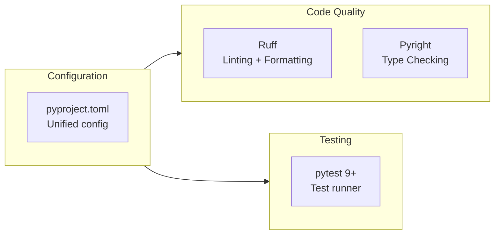
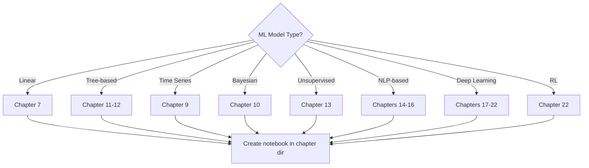
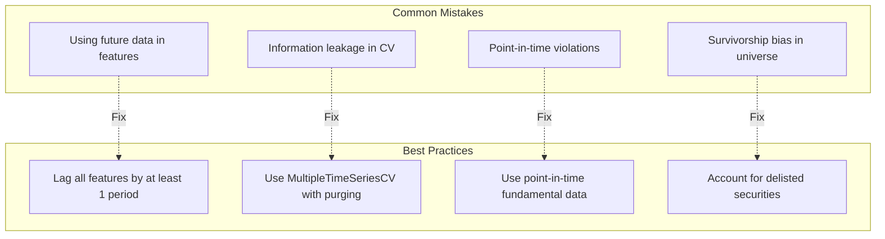
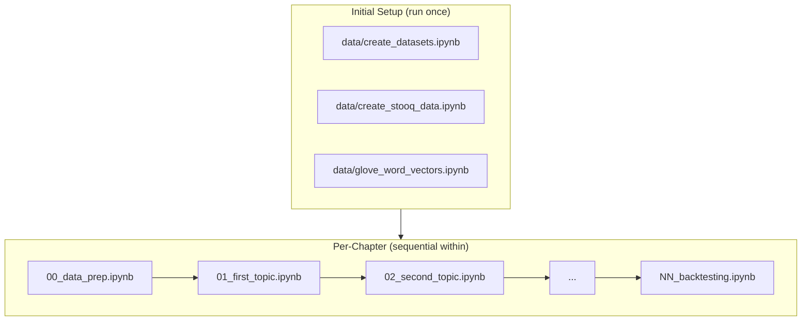

# Development Guide

> Development standards, adding new strategies and models, ML best practices for trading,
> and contribution guidelines for Machine Learning for Trading.

## Environment Setup

### Prerequisites

- Python 3.13+ (per `pyproject.toml`)
- Conda or pip for dependency management
- Jupyter Notebook or JupyterLab
- TA-Lib C library (required for technical indicator computation)

### Installation Methods

**Option 1: Conda (Recommended)**

```bash
cd machine-learning-for-trading/
conda env create -f installation/ml4t-base.yml
conda activate ml4t
```

**Option 2: pip**

```bash
pip install -r installation/ml4t-base.txt
```

**Option 3: Per-chapter installation**

Install dependencies incrementally as you work through chapters to avoid version conflicts.
Each chapter README lists its specific requirements.

### Platform-Specific Configs

| Platform | Directory |
|----------|-----------|
| Linux | `installation/linux/` |
| macOS | `installation/macosx/` |
| Windows | `installation/windows/` |

## Code Quality Standards

### Tooling

The project uses modern Python tooling configured in `pyproject.toml`:



### Ruff Configuration

```toml
[tool.ruff]
line-length = 88
target-version = "py313"

[tool.ruff.lint]
select = ["E", "W", "F", "I", "UP", "B", "SIM", "C4", "RUF", "PERF", "TC", "PTH"]
ignore = ["E501"]
```

Key rule categories enabled:
- **E/W**: pycodestyle errors and warnings
- **F**: pyflakes (unused imports, undefined names)
- **I**: isort-compatible import sorting
- **UP**: pyupgrade (modern Python syntax)
- **B**: flake8-bugbear (common pitfalls)
- **SIM**: flake8-simplify (code simplification)
- **PERF**: performance anti-patterns
- **PTH**: pathlib preference over os.path

### Running Quality Checks

```bash
# Lint all Python files
ruff check .

# Auto-fix issues
ruff check --fix .

# Format code
ruff format .

# Type checking
pyright

# Run tests
pytest
```

## Project Conventions

### Directory Structure for Chapters

Each chapter follows a consistent structure:

```
NN_chapter_name/
├── README.md                              # Chapter overview, content, resources
├── __init__.py                            # Package marker (where applicable)
├── 00_data_prep.ipynb                     # Data preparation (if needed)
├── 01_first_topic.ipynb                   # Sequential topic coverage
├── 02_second_topic.ipynb
├── ...
├── NN_backtesting_with_zipline.ipynb      # Backtesting (if applicable)
└── results/                               # Persisted model artifacts (optional)
```

### Notebook Naming

- Prefix with two-digit sequential number: `01_`, `02_`, etc.
- Use lowercase with underscores
- Names should describe the content clearly
- `00_` prefix for setup/data preparation notebooks
- Final notebooks in a chapter often cover backtesting

### Python Script Conventions

Standalone scripts (`.py` files) follow these patterns:

- Author attribution: `__author__ = 'Stefan Jansen'`
- Random seed: `np.random.seed(42)` for reproducibility
- Relative paths using `pathlib.Path`
- Type hints for function signatures

## Adding a New Strategy

### Step 1: Choose a Chapter Context

Determine which part of the project your strategy relates to:



### Step 2: Data Preparation

```python
# Standard data loading pattern
from pathlib import Path
import pandas as pd
import numpy as np

np.random.seed(42)

PROJECT_DIR = Path('..', '..')
DATA_DIR = PROJECT_DIR / 'data'

# Load from shared store
with pd.HDFStore(DATA_DIR / 'assets.h5') as store:
    prices = store['quandl/wiki/prices']
```

### Step 3: Feature Engineering

Use the alpha factor library (Chapter 24) as a starting point:

```python
import talib

# Technical indicators
df['SMA_20'] = talib.SMA(df['close'], timeperiod=20)
df['RSI_14'] = talib.RSI(df['close'], timeperiod=14)
df['MACD'], df['MACD_signal'], df['MACD_hist'] = talib.MACD(df['close'])

# Custom factors from Chapter 24
# See 24_alpha_factor_library/02_common_alpha_factors.ipynb
```

### Step 4: Model Training with Time-Series CV

Always use `MultipleTimeSeriesCV` from `utils.py` for validation:

```python
import sys
sys.path.insert(0, str(PROJECT_DIR))
from utils import MultipleTimeSeriesCV

cv = MultipleTimeSeriesCV(
    n_splits=12,
    train_period_length=252,
    test_period_length=63,
    lookahead=1,
    date_idx='date'
)

for train_idx, test_idx in cv.split(X):
    model.fit(X.iloc[train_idx], y.iloc[train_idx])
    predictions.append(model.predict(X.iloc[test_idx]))
```

### Step 5: Signal Evaluation with Alphalens

```python
from alphalens import utils, tears

factor_data = utils.get_clean_factor_and_forward_returns(
    factor=signals,
    prices=prices,
    quantiles=5,
    periods=(1, 5, 21)
)

tears.create_full_tear_sheet(factor_data)
```

### Step 6: Backtesting

Choose the appropriate backtesting approach:

| Approach | When to Use | Example |
|----------|-------------|---------|
| Vectorized | Quick iteration, simple signals | `08/.../02_vectorized_backtest.ipynb` |
| Backtrader | Realistic execution, complex logic | `08/.../03_backtesting_with_backtrader.ipynb` |
| Zipline | Full ML integration, pipeline API | `08/.../04_ml4t_workflow_with_zipline/` |

### Step 7: Performance Evaluation

```python
import pyfolio as pf

pf.create_full_tear_sheet(
    returns=strategy_returns,
    positions=positions,
    transactions=transactions,
    benchmark_rets=benchmark_returns
)
```

## ML Best Practices for Trading

### Avoiding Look-Ahead Bias



### Key Principles

1. **Time-series aware validation**: Never use standard k-fold CV on financial time series.
   Always use `MultipleTimeSeriesCV` or `TimeSeriesSplit` with appropriate purging gaps.

2. **Multiple testing correction**: When testing many strategies, apply statistical corrections
   (Chapter 8, `01_multiple_testing/`). A single good backtest among many trials is likely noise.

3. **Transaction costs**: Include realistic transaction costs in backtests. Vectorized backtests
   often omit these, leading to overly optimistic results.

4. **Regime awareness**: Financial markets change regimes. Train on diverse market conditions
   and evaluate robustness across regimes.

5. **Feature importance stability**: Check that feature importance is stable across time periods.
   Chapter 12 demonstrates SHAP analysis for this purpose.

### Common Pitfalls

| Pitfall | Chapter Reference | Mitigation |
|---------|-------------------|------------|
| Overfitting | Ch 6 (`03_bias_variance.ipynb`) | Regularization, early stopping, ensemble methods |
| Data snooping | Ch 8 (`01_multiple_testing/`) | FDR control, out-of-sample holdout |
| Survivorship bias | Ch 2 | Use point-in-time databases |
| Lookahead bias | Ch 6, 8 | Strict temporal separation in CV |
| Regime change | Ch 9, 10 | Rolling windows, Bayesian updating |
| Overly complex models | Ch 6 | Start simple, increase complexity only if justified |
| Ignoring transaction costs | Ch 5, 8 | Include slippage, commissions, market impact |

## Adding New Alpha Factors

### Using the Alpha Factor Library

Chapter 24 provides the framework for creating and evaluating new factors:

1. **Define the factor** in a function that takes OHLCV data and returns a signal Series
2. **Compute across the universe** using `04_alpha_factor_research/01_feature_engineering.ipynb` patterns
3. **Evaluate with Alphalens** using `24_alpha_factor_library/05_alphalens_analysis.ipynb`
4. **Compare with existing factors** using mutual information (`06/.../02_mutual_information.ipynb`)

### TA-Lib Factor Template

```python
import talib
import pandas as pd

def compute_custom_factor(df: pd.DataFrame) -> pd.Series:
    """Compute a custom alpha factor.

    Args:
        df: DataFrame with OHLCV columns

    Returns:
        Series with factor values, indexed by date
    """
    # Combine multiple indicators
    rsi = talib.RSI(df['close'], timeperiod=14)
    bb_upper, bb_middle, bb_lower = talib.BBANDS(df['close'])
    atr = talib.ATR(df['high'], df['low'], df['close'])

    # Custom signal logic
    signal = (df['close'] - bb_middle) / atr
    signal = signal.where(rsi < 70)  # Filter by RSI

    return signal
```

## Testing

### Test Configuration

Tests are configured in `pyproject.toml`:

```toml
[tool.pytest.ini_options]
minversion = "9.0"
addopts = ["-ra", "-q", "--strict-markers", "--import-mode=importlib"]
testpaths = ["tests"]
pythonpath = ["src"]
xfail_strict = true
filterwarnings = ["error"]
```

### Running Tests

```bash
# Run all tests
pytest

# Run with verbose output
pytest -v

# Run specific test file
pytest tests/test_specific.py

# Run with coverage
pytest --cov=. --cov-report=html
```

### Writing Tests for Trading Code

```python
import pytest
import numpy as np
import pandas as pd
from utils import MultipleTimeSeriesCV


def test_multiple_time_series_cv_splits():
    """Test that CV generates correct number of splits."""
    dates = pd.date_range('2020-01-01', periods=500, freq='B')
    symbols = ['AAPL', 'MSFT']
    idx = pd.MultiIndex.from_product([symbols, dates], names=['symbol', 'date'])
    X = pd.DataFrame(np.random.randn(len(idx), 5), index=idx)

    cv = MultipleTimeSeriesCV(
        n_splits=3,
        train_period_length=126,
        test_period_length=21,
        lookahead=1,
        date_idx='date'
    )

    splits = list(cv.split(X))
    assert len(splits) == 3
    for train_idx, test_idx in splits:
        assert len(train_idx) > 0
        assert len(test_idx) > 0
        # Verify no overlap
        assert len(set(train_idx) & set(test_idx)) == 0
```

## Working with Notebooks

### Notebook Best Practices

1. **Clear and restart**: Always restart kernel and run all cells before committing
2. **Deterministic output**: Set random seeds at the top of each notebook
3. **Memory management**: Clear large DataFrames when no longer needed
4. **Documentation**: Use markdown cells to explain reasoning and methodology

### Notebook Execution Order



## Dependency Management

### Key Library Versions

The project depends on a broad ecosystem. Critical dependencies from `installation/ml4t-base.txt`:

| Category | Libraries |
|----------|-----------|
| Core | numpy, pandas, scipy, scikit-learn |
| ML | xgboost, lightgbm, catboost, statsmodels |
| Deep Learning | tensorflow, pytorch |
| Bayesian | pymc3, arviz |
| NLP | spacy, gensim, textblob |
| Trading | zipline-reloaded, backtrader, alphalens-reloaded, pyfolio-reloaded, empyrical-reloaded |
| Technical Analysis | ta-lib |
| RL | gym, box2d |
| Visualization | matplotlib, seaborn, plotly, bokeh |

### Version Conflict Resolution

The project explicitly recommends per-chapter installation to avoid dependency conflicts.
Key known constraints:

- `gensim < 4.0` (API changes in 4.x)
- `zipline-reloaded` available on `conda-forge`
- `talib` requires the C library to be installed separately

### Development Dependencies

```bash
# Install dev extras
pip install -e ".[dev]"

# Includes:
# - ruff >= 0.11
# - pyright >= 1.1
# - pytest >= 9.0
```

## Contributing

### Commit Standards

Use conventional commit format:

```
feat: add new momentum factor to alpha library
fix: correct lookahead bias in cross-validation
docs: update chapter 12 README with SHAP examples
refactor: simplify data loading in utils.py
test: add tests for MultipleTimeSeriesCV
```

### Pull Request Checklist

- [ ] Code passes `ruff check .` with no errors
- [ ] Code passes `pyright` type checking
- [ ] Tests pass: `pytest`
- [ ] Notebooks execute cleanly (restart kernel + run all)
- [ ] Random seeds set for reproducibility
- [ ] No look-ahead bias in feature construction
- [ ] Time-series aware cross-validation used
- [ ] README updated if adding new content

## Configuration Reference

The project uses `pyproject.toml` for tool configuration and conda/pip files for dependencies. There is no single application config file; configuration is per-notebook via inline constants.

**pyproject.toml tool settings:**

| Parameter | Type | Default | Description |
|-----------|------|---------|-------------|
| `[tool.ruff] line-length` | `int` | `88` | Maximum line length for linting/formatting |
| `[tool.ruff] target-version` | `str` | `"py313"` | Python version target for ruff rules |
| `[tool.ruff.lint] select` | `list[str]` | `["E","W","F","I","UP","B","SIM","C4","RUF","PERF","TC","PTH"]` | Enabled lint rule categories |
| `[tool.ruff.lint] ignore` | `list[str]` | `["E501"]` | Ignored rules (line length handled by formatter) |
| `[tool.pytest.ini_options] minversion` | `str` | `"9.0"` | Minimum pytest version |
| `[tool.pytest.ini_options] testpaths` | `list[str]` | `["tests"]` | Test discovery paths |
| `[tool.pytest.ini_options] xfail_strict` | `bool` | `true` | xfail tests that pass will fail |
| `[tool.pytest.ini_options] filterwarnings` | `list[str]` | `["error"]` | Treat all warnings as errors in tests |

**Common notebook constants:**

| Variable | Typical Value | Description |
|----------|--------------|-------------|
| `PROJECT_DIR` | `Path('..', '..')` | Path to repo root (used for data access) |
| `DATA_DIR` | `PROJECT_DIR / 'data'` | Shared data directory |
| `RESULTS_DIR` | `Path('results')` | Per-chapter model artifact storage |
| `np.random.seed(42)` | `42` | Standard random seed for reproducibility |
| `idx` | `pd.IndexSlice` | Pandas IndexSlice convenience variable |

**MultipleTimeSeriesCV parameters** (from `utils.py`):

| Parameter | Type | Default | Description |
|-----------|------|---------|-------------|
| `n_splits` | `int` | (required) | Number of cross-validation folds |
| `train_period_length` | `int` | (required) | Training window in trading days |
| `test_period_length` | `int` | (required) | Test window in trading days |
| `lookahead` | `int` | `1` | Gap between train and test to prevent leakage |
| `date_idx` | `str` | `"date"` | Name of the date level in MultiIndex |
| `shuffle` | `bool` | `False` | Whether to shuffle (should remain False for time series) |

## Troubleshooting

### 1. `ImportError: No module named 'talib'`

TA-Lib requires a C library installed at the system level before the Python wrapper:
```bash
# Ubuntu/Debian
sudo apt-get install -y libta-lib0-dev
# macOS
brew install ta-lib
# Then install Python wrapper
pip install TA-Lib
```

### 2. Conda environment creation fails with version conflicts

Use the per-chapter installation approach instead of the full environment:
```bash
pip install numpy pandas scikit-learn matplotlib jupyter
# Add chapter-specific packages as needed
```

### 3. `FileNotFoundError: data/assets.h5` or similar HDF5 file missing

Run the data creation notebooks first:
```bash
cd data/
jupyter notebook create_datasets.ipynb   # Requires Quandl API key
jupyter notebook create_stooq_data.ipynb  # Downloads from stooq.com
```

### 4. Quandl API returns 403 Forbidden

Register for a free API key at [data.nasdaq.com](https://data.nasdaq.com/) and set it:
```python
import os
os.environ['QUANDL_API_KEY'] = 'your_key_here'
# Or: quandl.ApiConfig.api_key = 'your_key_here'
```

### 5. Stooq automatic download no longer works

Since December 2020, Stooq requires CAPTCHA for downloads. Navigate to [stooq.com](https://stooq.com) manually, download the zip files, and place them in the expected directory. The `create_stooq_data.ipynb` notebook explains the expected file structure.

### 6. Zipline/Backtrader import errors

These packages have complex dependency chains. Install from conda-forge:
```bash
conda install -c conda-forge zipline-reloaded backtrader
```

### 7. Notebook kernel dies during large model training

Deep learning chapters (17-22) require significant memory. Reduce batch sizes or use a subset of data. GPU is recommended for chapters 17-22.

### 8. `gensim` API incompatibility errors

The book was written for gensim < 4.0. If using gensim 4.x, note that `Word2Vec` model access changed from `model.wv[word]` to `model.wv.get_vector(word)`, and `most_similar()` moved to `model.wv.most_similar()`.

### 9. PyMC3 sampling extremely slow

Chapter 10 uses PyMC3 for Bayesian inference. Install `theano-pymc` (not plain theano) and ensure a BLAS library is available:
```bash
conda install -c conda-forge pymc3 mkl-service
```

### 10. Alphalens/pyfolio import fails

Use the "reloaded" forks which are actively maintained:
```bash
pip install alphalens-reloaded pyfolio-reloaded empyrical-reloaded
```

## Security Considerations

- **API keys**: Several notebooks require API keys (Quandl, Twitter, etc.). Never hardcode keys in notebooks. Use environment variables or a `.env` file excluded from version control via `.gitignore`.
- **Data licensing**: Market data from Quandl, Algoseek, NASDAQ ITCH, and Stooq may have redistribution restrictions. Do not commit downloaded datasets to public repositories.
- **Pickle files**: Some notebooks save models using `pickle` or `joblib`. Pickle files can execute arbitrary code on load. Only load pickle files you created yourself.
- **HDF5 store**: The `assets.h5` file can grow to several GB. It stores raw market data and should be treated as sensitive if it contains licensed data. Set file permissions appropriately.
- **Notebook outputs**: Clear notebook outputs before committing, as cell outputs may contain data samples, API responses, or paths that reveal infrastructure details.
- **Third-party packages**: The dependency list is extensive (50+ packages). Pin versions in requirements files and audit updates, especially for packages with native extensions (TA-Lib, PyTorch, TensorFlow).
- **Reproducibility vs security**: Setting `np.random.seed(42)` is for reproducibility, not security. Do not use Python's `random` module or NumPy's legacy random for cryptographic purposes.

---
## See Also
- [README](README.md) — Project overview and quick start
- [Architecture](architecture.md) — System design and components
- [Workflow](workflow.md) — Event flows and processing pipelines
- [State Management](state-management.md) — State lifecycle and data models
