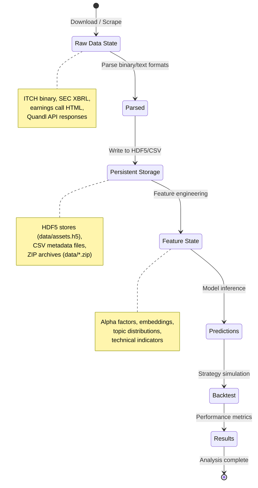
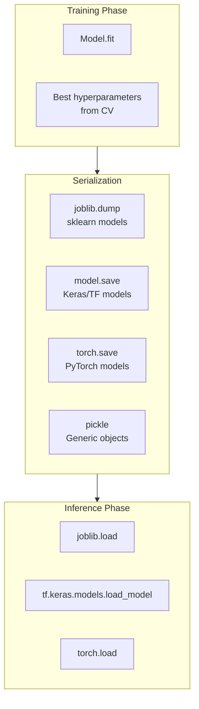
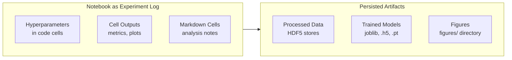
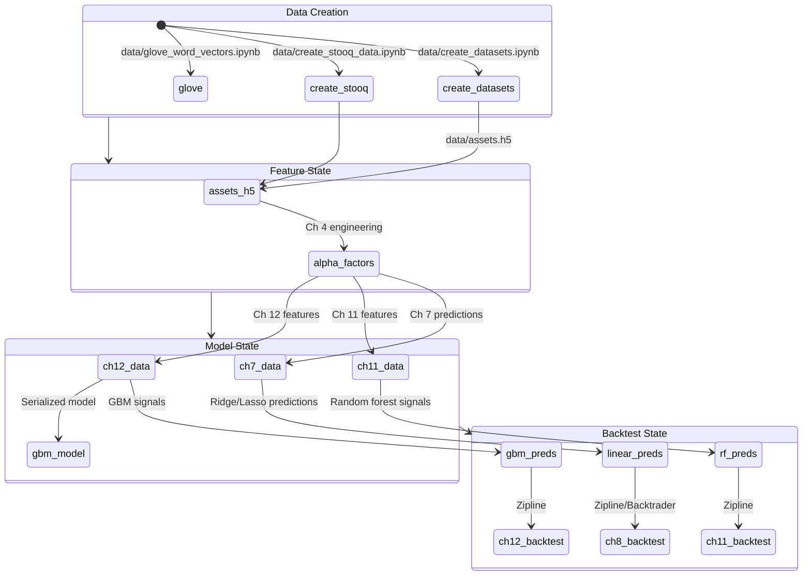
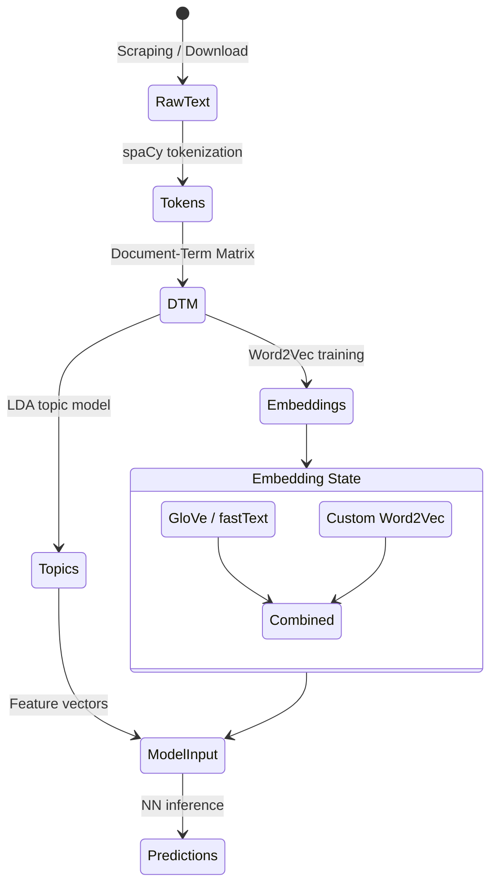

# State Management

> How the project manages data state, model state, experiment tracking, and results persistence
> across 150+ notebooks and 24 chapters.

## Overview

Machine Learning for Trading manages state across multiple dimensions: raw data, processed
features, trained models, predictions, and backtest results. The project uses a file-based
persistence approach with HDF5 as the primary storage format, supplemented by joblib for
model serialization and CSV for metadata.

## Data State Lifecycle



## HDF5 Storage Architecture

HDF5 is the primary data persistence mechanism. The project uses `pd.HDFStore` for
hierarchical storage of DataFrames with efficient read/write of large panel datasets.

### Central Data Store

The main store at `data/assets.h5` holds shared price and fundamental data:

```python
# Pattern from 08_ml4t_workflow/00_data/data_prep.py
with pd.HDFStore(DATA_DIR / 'assets.h5') as store:
    prices = (store['quandl/wiki/prices']
              .filter(like='adj')
              .rename(columns=lambda x: x.replace('adj_', ''))
              .swaplevel(axis=0))
```

### Chapter-Level Stores

Individual chapters maintain their own HDF5 files for intermediate results:

| Chapter | Store | Contents |
|---------|-------|----------|
| 07 | `07_linear_models/data.h5` | Regression predictions (lasso, ridge, OLS) |
| 08 | Cross-references `07_linear_models/data.h5` | Backtest data combining predictions with OHLCV |
| 11 | Chapter-local stores | Random forest features and predictions |
| 12 | Chapter-local stores | GBM predictions, feature data |
| 15 | `15_topic_modeling/results/` | LDA topic distributions |
| 20 | Chapter-local stores | Autoencoder latent representations |

### HDF5 Key Naming Conventions

```
quandl/wiki/prices     - Quandl Wiki daily prices
quandl/wiki/stocks     - Stock metadata
lasso/predictions      - Lasso model predictions
ridge/predictions      - Ridge model predictions
```

## Model State Management

### Model Serialization Patterns



### Serialized Artifacts

| Format | Location | Model Type |
|--------|----------|------------|
| `.joblib` | `12_gradient_boosting_machines/results/sklearn_gbm_gridsearch.joblib` | scikit-learn GridSearchCV results |
| Keras `.h5` | Chapter-local | TensorFlow/Keras neural networks |
| PyTorch `.pt` | Chapter-local | PyTorch models |
| Pickle `.pkl` | Chapter-local | General Python objects |

### Grid Search State (Chapter 12)

The gradient boosting chapter persists full grid search results for later analysis:

```python
# Pattern from 12_gradient_boosting_machines
from joblib import dump, load

# After training
dump(grid_search, 'results/sklearn_gbm_gridsearch.joblib')

# For analysis
grid_search = load('results/sklearn_gbm_gridsearch.joblib')
best_params = grid_search.best_params_
cv_results = pd.DataFrame(grid_search.cv_results_)
```

## Experiment Tracking

The project uses a notebook-centric experiment tracking approach rather than a dedicated
experiment management system. State is tracked through:

### Notebook Execution State

Each notebook maintains its own execution state. The project recommends running notebooks
in executed form, where cell outputs serve as the experiment log.



### Cross-Chapter Prediction Tracking

Predictions flow between chapters through HDF5 stores. The canonical example:

1. **Chapter 7** trains linear models, stores predictions in `07_linear_models/data.h5`
2. **Chapter 8** loads these predictions via `08_ml4t_workflow/00_data/data_prep.py`
3. **Chapter 8** combines predictions with OHLCV data for backtesting

```python
# From data_prep.py - Cross-chapter state loading
def get_backtest_data(predictions='lasso/predictions'):
    with pd.HDFStore(DATA_DIR / 'assets.h5') as store:
        prices = store['quandl/wiki/prices']
    with pd.HDFStore(PROJECT_DIR / '07_linear_models/data.h5') as store:
        predictions = store[predictions]
```

## Results Persistence

### Performance Results

Backtest and evaluation results are persisted in several ways:

| Method | Used By | Purpose |
|--------|---------|---------|
| Notebook cell output | All chapters | Inline metrics display |
| `figures/` directory | Root level | Color versions of book charts |
| Chapter `results/` dirs | Ch 12, 15 | Serialized model results |
| Alphalens tear sheets | Ch 4, 7, 11, 12, 20, 24 | Factor evaluation reports |
| pyfolio tear sheets | Ch 5, 8 | Strategy performance reports |

### Figures Directory

The root `figures/` directory stores color versions of all charts from the book,
providing a visual record of experiment results across all chapters.

## Data Dependencies and State Flow



## Cross-Validation State

### MultipleTimeSeriesCV State Management

The custom cross-validator in `utils.py` manages temporal state to prevent data leakage:

| Parameter | Purpose | Typical Value |
|-----------|---------|---------------|
| `n_splits` | Number of train/test periods | 12 (monthly evaluation) |
| `train_period_length` | Training window size | 252 (1 trading year) |
| `test_period_length` | Test window size | 63 (1 quarter) |
| `lookahead` | Purging gap between train and test | 1-5 days |
| `date_idx` | Date level in MultiIndex | `'date'` |

The validator generates non-overlapping temporal splits, maintaining the state invariant
that no future information leaks into training data.

## Text Data State Pipeline

### NLP State Transformations

Text data passes through several state transformations before reaching models:



### Embedding Persistence

| Embedding Type | Source | Storage |
|---------------|--------|---------|
| GloVe pretrained | `data/glove_word_vectors.ipynb` | Downloaded vectors |
| Word2Vec (TF) | `16/.../04_financial_news_word2vec_tensorflow.ipynb` | TF checkpoints |
| Word2Vec (gensim) | `16/.../05_financial_news_word2vec_gensim.ipynb` | gensim model files |
| Doc2Vec | `16/.../08_doc2vec_yelp_sentiment.ipynb` | gensim model files |
| SEC embeddings | `16/.../07_sec_word2vec.ipynb` | Custom trained vectors |

## Reinforcement Learning State

### Trading Environment State (`trading_env.py`)

The RL trading environment maintains episode state:

| State Component | Type | Description |
|----------------|------|-------------|
| `observation` | `np.ndarray` | Current OHLCV + technical indicators (scaled) |
| `position` | Discrete | Current portfolio position |
| `portfolio_value` | Float | Current portfolio value |
| `step_count` | Integer | Current step in episode |
| `done` | Boolean | Episode termination flag |

### Agent State

| Component | Persistence | Used In |
|-----------|-------------|---------|
| Q-table | In-memory dict | `02_gridworld_q_learning.ipynb` |
| DQN weights | Keras model save | `03_lunar_lander_deep_q_learning.ipynb` |
| Replay buffer | In-memory deque | `03_lunar_lander_deep_q_learning.ipynb` |
| Episode rewards | List / DataFrame | All RL notebooks |

## Configuration State

### Project Configuration (`pyproject.toml`)

```toml
[project]
name = "machine-learning-for-trading"
version = "0.1.0"
requires-python = ">=3.13"

[tool.ruff]
line-length = 88
target-version = "py313"
```

### Environment Configuration (`installation/`)

Platform-specific conda environments define the dependency state:

| Platform | Config Files |
|----------|-------------|
| Cross-platform | `ml4t-base.yml`, `ml4t-base.txt` |
| Linux | `installation/linux/` |
| macOS | `installation/macosx/` |
| Windows | `installation/windows/` |

### Random State

The project sets random seeds for reproducibility:

```python
# From utils.py
np.random.seed(42)

# Pattern repeated across notebooks
np.random.seed(42)
tf.random.set_seed(42)
torch.manual_seed(42)
```

## State Recovery and Reproducibility

### Notebook Execution Order

Chapters are designed to be executed sequentially within each chapter. Cross-chapter
dependencies require specific notebooks to be run first:

1. **First**: Run `data/create_datasets.ipynb` to populate `data/assets.h5`
2. **Then**: Individual chapter notebooks in numeric order
3. **Cross-chapter**: Chapter 8 requires Chapter 7 predictions to be generated first

### Stateless Computation

Most notebooks can be re-run independently as they load state from persistent HDF5
stores. The exceptions are notebooks that depend on prior notebook outputs within
the same chapter (indicated by sequential numbering).

### Storage Format Summary

| Format | Extension | Use Case | Read Method |
|--------|-----------|----------|-------------|
| HDF5 | `.h5` | Panel data, time series | `pd.HDFStore`, `pd.read_hdf` |
| CSV | `.csv` | Metadata, small datasets | `pd.read_csv` |
| Joblib | `.joblib` | sklearn models, grid search | `joblib.load` |
| Pickle | `.pkl` | General Python objects | `pickle.load` |
| Excel | `.xlsx` | Reference tables | `pd.read_excel` |
| ZIP | `.zip` | Compressed text corpora | `zipfile.ZipFile` |
| Keras HDF5 | `.h5` | Neural network weights | `tf.keras.models.load_model` |
| PyTorch | `.pt`, `.pth` | NN state dicts | `torch.load` |

---
## See Also
- [README](README.md) — Project overview and quick start
- [Architecture](architecture.md) — System design and components
- [Workflow](workflow.md) — Event flows and processing pipelines
- [Development](development.md) — Development guide and best practices
