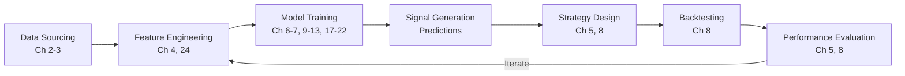
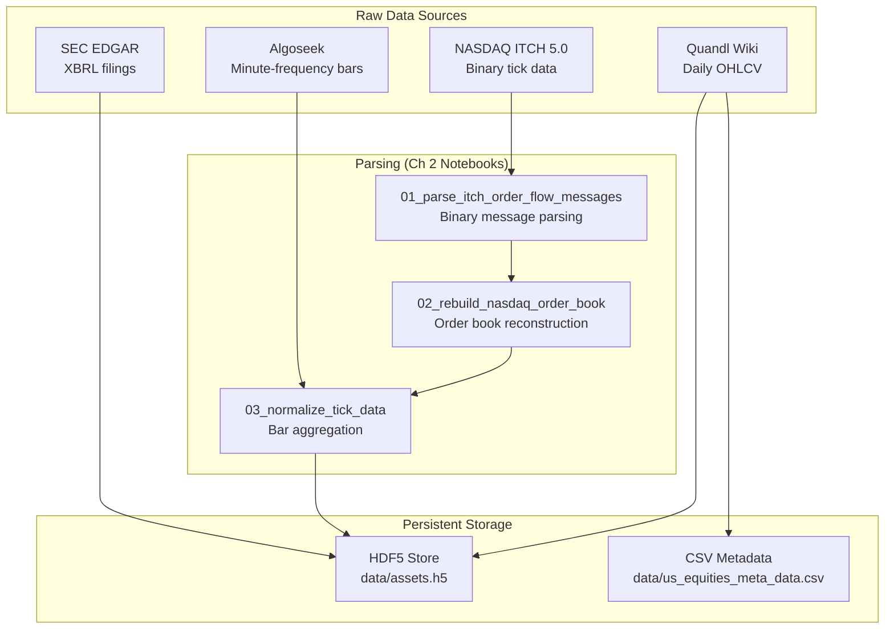
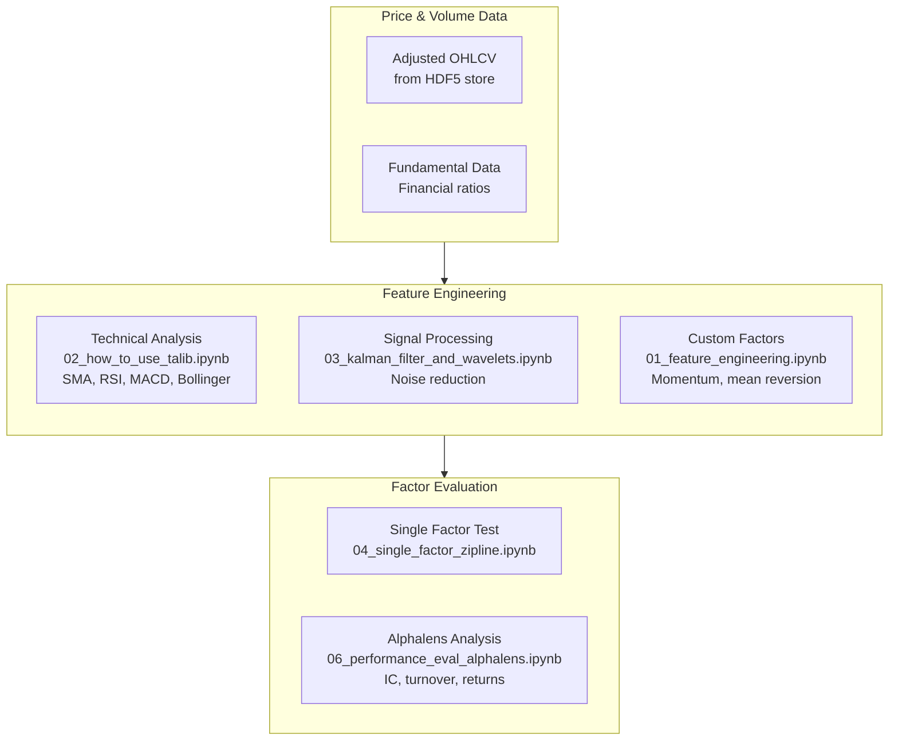
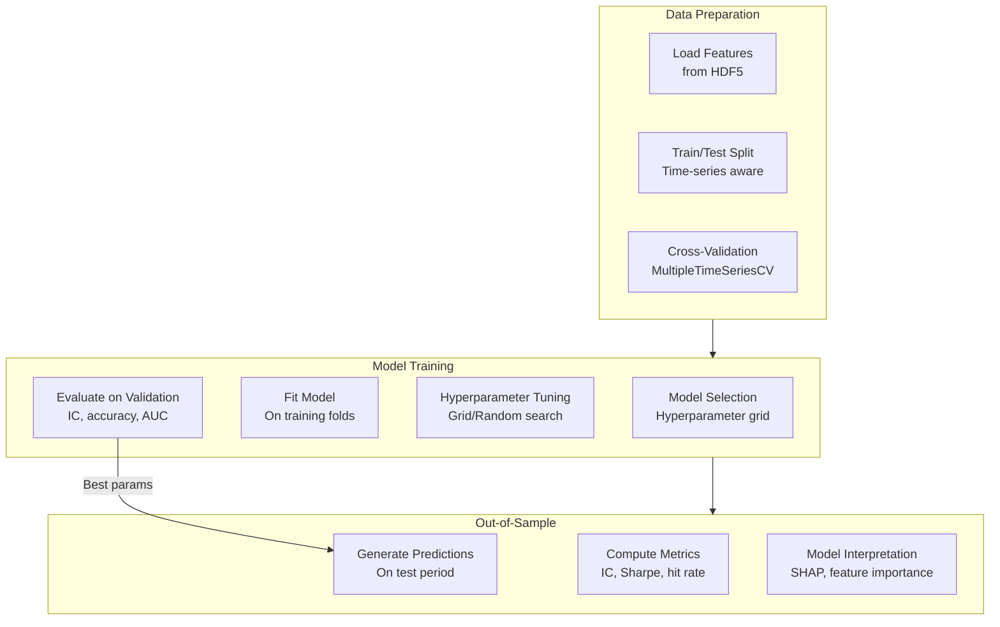
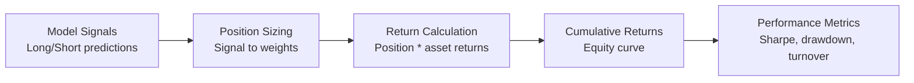
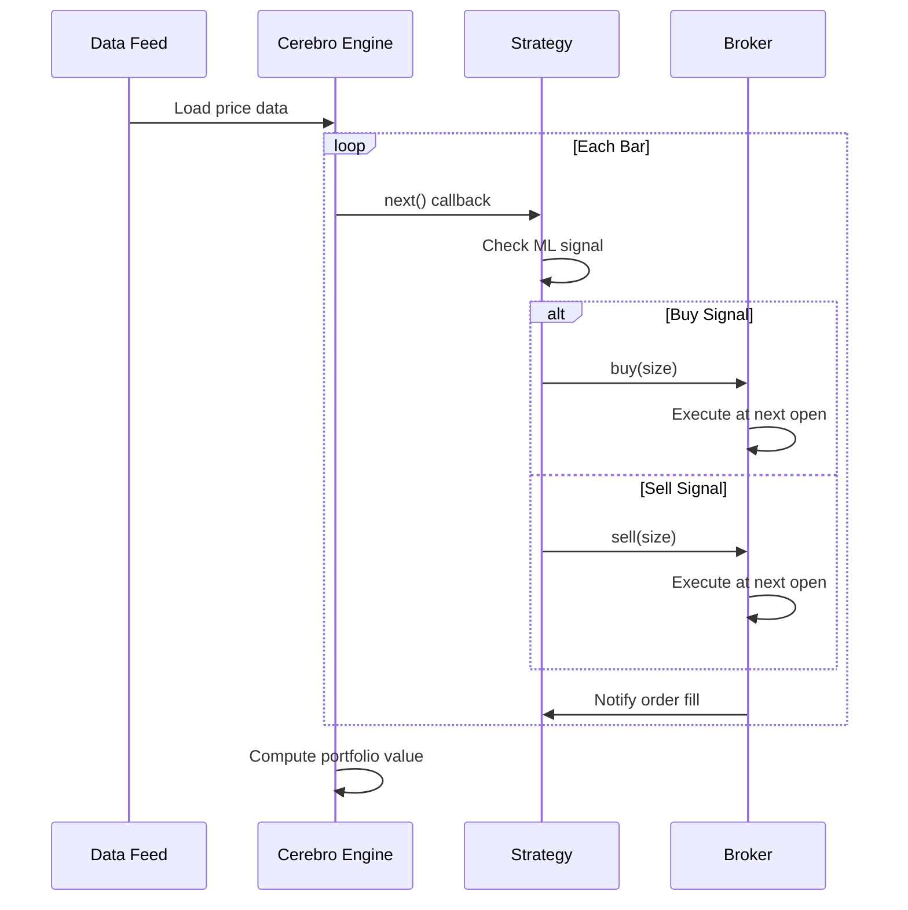
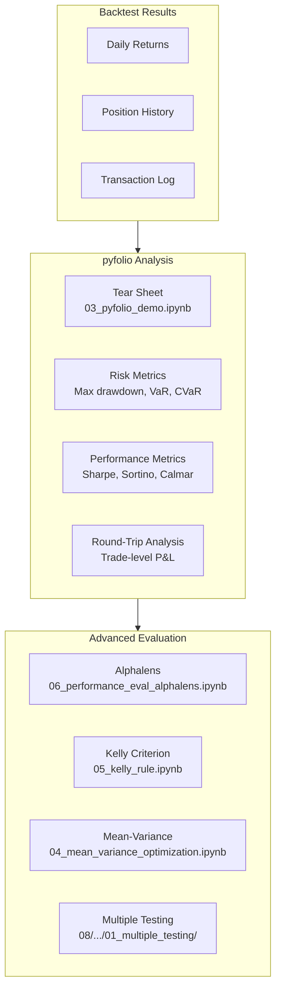
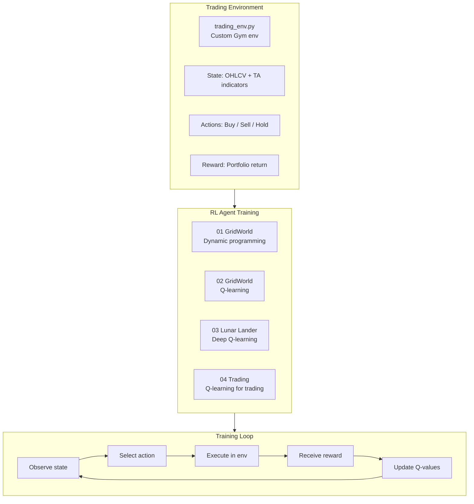

# Workflow

> Data preparation, feature engineering, model training, backtesting, and strategy evaluation
> flows used throughout the ML for Trading project.

## The ML4T Workflow Overview

The central workflow of this project follows a structured pipeline from raw data to
deployed trading strategy. Chapter 8 formalizes this as the "ML4T Workflow" that
connects every other chapter.



## Data Preparation Flow

### Market Data Pipeline (Chapter 2)

Raw market data is parsed, normalized, and stored in HDF5 format for efficient access
across all downstream chapters.



### Text Data Pipeline (Chapters 3, 14-16)

Text data follows a distinct path through NLP preprocessing before joining the
feature engineering pipeline.

| Step | Notebook | Output |
|------|----------|--------|
| Scrape earnings calls | `03_alternative_data/02_earnings_calls/` | Raw transcripts |
| Tokenize with spaCy | `14/.../01_nlp_pipeline_with_spaCy.ipynb` | Token sequences |
| Build DTM | `14/.../03_document_term_matrix.ipynb` | Sparse term-document matrix |
| Extract topics | `15/.../04_lda_with_sklearn.ipynb` | Topic distributions |
| Train embeddings | `16/.../04_financial_news_word2vec_tensorflow.ipynb` | Dense word vectors |
| SEC filing analysis | `16/.../06_sec_preprocessing.ipynb` | Filing-level features |

### Data Creation Notebooks (`data/`)

The shared `data/` directory contains notebooks for creating standardized datasets:

| Notebook | Purpose |
|----------|---------|
| `create_datasets.ipynb` | Core equity datasets from Quandl Wiki |
| `create_stooq_data.ipynb` | International equity data from Stooq |
| `create_yelp_review_data.ipynb` | Yelp review data for NLP tasks |
| `glove_word_vectors.ipynb` | Download and prepare GloVe embeddings |
| `twitter_sentiment.ipynb` | Twitter sentiment dataset |

## Feature Engineering Flow

### Alpha Factor Research (Chapter 4)

Chapter 4 demonstrates the complete feature engineering pipeline from raw price
data to evaluated alpha factors.



### Alpha Factor Library (Chapter 24)

Chapter 24 provides a comprehensive factor library with 100+ indicators:

| Notebook | Content | Factor Count |
|----------|---------|-------------|
| `00_indicator_zoo.ipynb` | TA-Lib indicator catalogue | 50+ technical indicators |
| `01_sample_selection.ipynb` | Universe definition | Equity selection criteria |
| `02_common_alpha_factors.ipynb` | Standard quant factors | Momentum, value, quality |
| `03_101_formulaic_alphas.ipynb` | WorldQuant 101 Alphas | 101 formulaic factors |
| `04_factor_evaluation.ipynb` | Feature importance, SHAP | Factor ranking |
| `05_alphalens_analysis.ipynb` | Alphalens integration | IC, quintile returns |

### Feature Types Across the Project

| Category | Source Chapters | Examples |
|----------|----------------|----------|
| Technical | 4, 24 | Moving averages, RSI, MACD, Bollinger Bands, ATR |
| Fundamental | 2, 4 | P/E ratio, book value, earnings yield |
| Statistical | 9 | Autocorrelation, stationarity measures, volatility |
| Text-derived | 14-16 | Sentiment scores, topic weights, embedding distances |
| Image-derived | 18 | CNN features from time-series-to-image conversion |
| Engineered | 6, 12 | Mutual information, interaction terms, lagged returns |

## Model Training Flow

### General Supervised Learning Workflow (Chapter 6)

The standard ML training loop is demonstrated in Chapter 6 and applied consistently
across all supervised learning chapters.



### Time-Series Cross-Validation

The `MultipleTimeSeriesCV` class from `utils.py` is the backbone of model validation
across the project. It ensures:

1. **No look-ahead bias**: Training data always precedes test data
2. **Purging**: Overlapping outcome periods are removed between train and test
3. **Panel-aware**: Works with MultiIndex data (`symbol` x `date`)

```python
# Usage pattern across chapters 7, 11, 12, 20
cv = MultipleTimeSeriesCV(
    n_splits=12,
    train_period_length=252,    # ~1 year of trading days
    test_period_length=63,      # ~1 quarter
    lookahead=1,
    date_idx='date'
)
for train_idx, test_idx in cv.split(X):
    model.fit(X.iloc[train_idx], y.iloc[train_idx])
    predictions = model.predict(X.iloc[test_idx])
```

### Chapter-Specific Training Patterns

| Chapter | Model | Key Notebook | Special Considerations |
|---------|-------|-------------|----------------------|
| 07 | Linear/Logistic | `05_predicting_stock_returns_with_linear_regression.ipynb` | Regularization path, Fama-MacBeth |
| 09 | ARIMA/GARCH | `02_arima_models.ipynb` | Stationarity tests, rolling windows |
| 10 | Bayesian | `02_pymc3_workflow.ipynb` | MCMC sampling, convergence diagnostics |
| 11 | Random Forest | `05_random_forest_return_signals.ipynb` | Feature importance, Japanese equities |
| 12 | Gradient Boosting | `05_trading_signals_with_lightgbm_and_catboost.ipynb` | Early stopping, SHAP values |
| 17 | Feedforward NN | `04_optimizing_a_NN_architecture_for_trading.ipynb` | Architecture search, dropout |
| 18 | CNN | `07_cnn_for_trading.ipynb` | Image format conversion, transfer learning |
| 19 | LSTM/GRU | `02_stacked_lstm_with_feature_embeddings.ipynb` | Sequence length, embedding layers |
| 20 | Autoencoder | `06_conditional_autoencoder_for_asset_pricing_model.ipynb` | Conditional risk factors |
| 22 | DQN | `04_q_learning_for_trading.ipynb` | Reward shaping, experience replay |

## Backtesting Flow

### Vectorized Backtesting (Chapter 8)

Fast signal evaluation using pandas operations.



Implemented in `08_ml4t_workflow/02_vectorized_backtest.ipynb`.

### Event-Driven Backtesting with Backtrader (Chapter 8)



Implemented in `08_ml4t_workflow/03_backtesting_with_backtrader.ipynb`.

### Zipline ML4T Workflow (Chapter 8)

The most comprehensive backtesting approach integrates ML predictions directly
into Zipline's event loop.

Key files in `08_ml4t_workflow/04_ml4t_workflow_with_zipline/`:

| File | Purpose |
|------|---------|
| `01_custom_bundles/` | Custom data ingestion for non-standard sources |
| `02_backtesting_with_zipline.ipynb` | Standard Zipline backtest |
| `03_ml4t_with_zipline.ipynb` | ML model predictions integrated into Zipline pipeline |

### Strategy-Specific Backtests

| Strategy | Chapter | Notebook | Universe |
|----------|---------|----------|----------|
| Single alpha factor | 04 | `04_single_factor_zipline.ipynb` | US equities |
| Mean-variance portfolio | 05 | `04_mean_variance_optimization.ipynb` | US equities |
| Linear model signals | 08 | `04/.../03_ml4t_with_zipline.ipynb` | US equities |
| Pairs trading | 09 | `07_pairs_trading_backtest.ipynb` | Cointegrated pairs |
| Random forest long-short | 11 | `07_backtesting_with_zipline.ipynb` | Japanese equities |
| Gradient boosting | 12 | `09_backtesting_with_zipline.ipynb` | US equities |
| GBM intraday | 12 | `11_intraday_model.ipynb` | US equities (minute) |
| Deep NN signals | 17 | `05_backtesting_with_zipline.ipynb` | US equities |
| CNN time-series images | 18 | `08_backtesting_with_zipline.ipynb` | US equities |
| RL trading agent | 22 | `04_q_learning_for_trading.ipynb` | Single stock |

## Strategy Evaluation Flow

### Performance Analysis with pyfolio (Chapter 5)



### Signal Quality Evaluation with Alphalens

Alphalens evaluation is used across multiple chapters to assess factor quality before
backtesting. The standard metrics include:

| Metric | Description | Used In |
|--------|-------------|---------|
| Information Coefficient (IC) | Rank correlation of factor with forward returns | Ch 4, 7, 11, 12, 20, 24 |
| IC Information Ratio | Mean IC / Std IC | Ch 4, 24 |
| Quantile Returns | Returns of factor-sorted portfolios | Ch 4, 11, 12, 24 |
| Factor Turnover | Portfolio rebalancing frequency | Ch 4, 24 |
| Cumulative Factor Returns | Long-short portfolio performance | Ch 7, 11, 12 |

### Multiple Testing Correction (Chapter 8)

Chapter 8 includes `01_multiple_testing/` covering the critical issue of data snooping
when evaluating many strategies. This addresses:

- Family-wise error rate (FWER) corrections
- False discovery rate (FDR) control
- Deflated Sharpe Ratio methodology
- Minimum backtest length requirements

## Reinforcement Learning Workflow (Chapter 22)



## End-to-End Example: Gradient Boosting Strategy (Chapter 12)

This chapter demonstrates the most complete workflow in the project:

1. **Data Preparation** (`04_preparing_the_model_data.ipynb`): Load and align features
2. **Model Training** (`05_trading_signals_with_lightgbm_and_catboost.ipynb`): Train with `MultipleTimeSeriesCV`
3. **Signal Evaluation** (`06_evaluate_trading_signals.ipynb`): Alphalens factor analysis
4. **Model Interpretation** (`07_model_interpretation.ipynb`): SHAP values and feature importance
5. **Prediction Generation** (`08_making_out_of_sample_predictions.ipynb`): Out-of-sample signals
6. **Backtesting** (`09_backtesting_with_zipline.ipynb`): Zipline backtest with ML signals
7. **Intraday Extension** (`10_intraday_features.ipynb` + `11_intraday_model.ipynb`): Minute-frequency variant

This pattern -- data prep, train, evaluate signals, interpret, predict, backtest -- is
the canonical ML4T workflow that the entire book builds toward.

---
## See Also
- [README](README.md) — Project overview and quick start
- [Architecture](architecture.md) — System design and components
- [State Management](state-management.md) — State lifecycle and data models
- [Development](development.md) — Development guide and best practices
